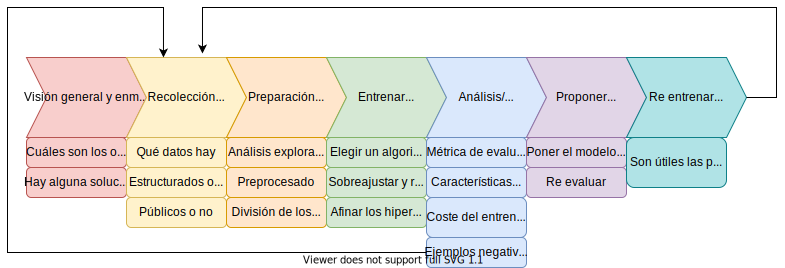

# ML-predicting-airbnb
En este ejercicio simulado se van a obtener ciertos datos, y usarlos para poner a prueba varios algoritmos de aprendizaje supervisado de clasificación.  Los datos provienen de la web InsideAirBnB, dedicada al estudio de los alquileres vacacionales ofrecidos en la plataforma AirBnB. Este fichero es una versión editada, del listado original de información sobre las ofertas existentes, para la ciudad de Madrid, en abril de 2017.  La tarea de clasificación consistirá en clasificar los datos según el tipo de alojamiento, definido en el campo room_type, a partir del resto de características.

